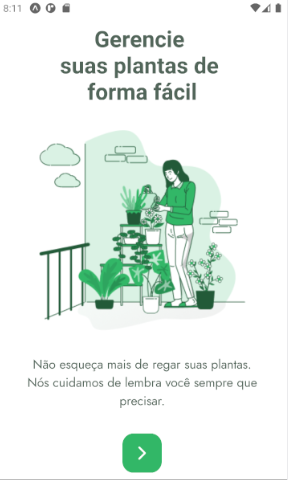
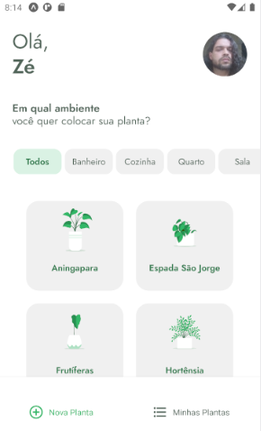
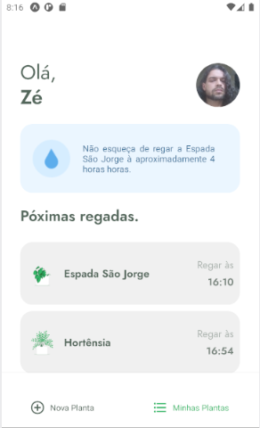

# Plant Manager
🌾 App construidona Next Level Week 5 para cadastrar suas plantinhas e nunca mais esquecer de cuida delas.

  
  


## Executando local

### Pré-requisitos

* Você deve ter o git, node, expo, json-server instalado em sua máquina;


### Para executar este projeto, siga as instruções abaixo:

1. Abra o Prompt de comando (CMD) ou a sua escolha;

2. Clone este repositório do github:

```
$ git clone https://github.com/Zzeris/plantmanager.git
```

3. Entre na pasta 'plantmanager':

```
$ cd plantmanager
```

3. Baixe as dependências:

```
$ yarn
```

4. Agora, inicialize o Json-Server:

```
$ json-server .src/services/server.json --host localhost --port 3333 --delay 700
```

4. Inicialize também o expo:

```
$ expo start
```

Acesse o app pelo expo QRCode ou Emulador IOS ou Android.
